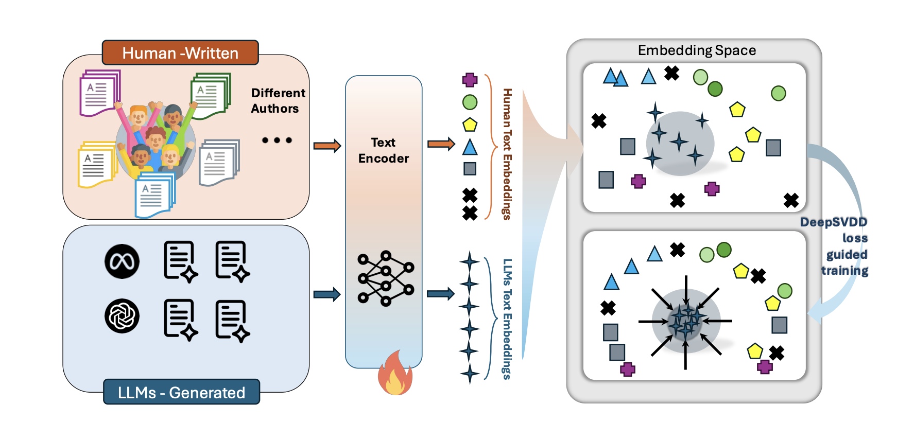

# 🧠 Human Texts Are Outliers: Detecting LLM-generated Texts via Out-of-Distribution Detection (NeurIPS 2025)

## 📚 Paper

**Human Texts Are Outliers: Detecting LLM-generated Texts via Out-of-Distribution Detection**  
*Cong Zeng\*, Shengkun Tang\*, Yuanzhou Chen, Zhiqiang Shen, Wenchao Yu, Xujiang Zhao, Haifeng Chen, Wei Cheng†, Zhiqiang Xu†*  
*NeurIPS 2025*  

📄 [Paper](https://openreview.net/forum?id=0XKZFK4hQt&referrer=%5BAuthor%20Console%5D(%2Fgroup%3Fid%3DNeurIPS.cc%2F2025%2FConference%2FAuthors%23your-submissions))

---



---

## 📘 Overview

**This repository implements an Out-of-Distribution (OOD) detection framework**, reframing human text detection as an OOD task. Instead of treating human and machine text as two balanced classes, we **model LLM-generated text as in-distribution (ID)** and **human-written text as out-of-distribution (OOD)**.  

We introduce a suite of OOD-based detectors — **DeepSVDD**, **HRN**, and **Energy-based methods** — that achieve **state-of-the-art (SoTA)** detection performance across multilingual, adversarial, and unseen-model scenarios.

### 🧪 Datasets

| Dataset | Description | Focus |
|----------|-------------|--------|
| **DeepFake** | 27 LLMs + multi-domain human text | Cross-domain & model generalization |
| **M4** | Multi-lingual, multi-domain dataset | Multilingual robustness |
| **RAID** | Adversarially perturbed LLM text | Attack robustness |

You can download DeepFake and M4 dataset from [Google Drive](https://drive.google.com/drive/folders/17Uyc1PIT7YWi1IGrKVb4IfkB9QYnxSGD?usp=sharing). You can find our pre-processed RAID dataset on [Huggingface](https://huggingface.co/datasets/Shengkun/Raid_split). (You don't need to download yourself, the script will download the dataset automatically).

## ⚙️ Installation

### Using Conda

```bash
conda create -n ood_llm_detect python=3.10
conda activate ood_llm_detect
pip install -r requirements.txt
```

### Inference Demo

We provide a simple inference demo. You can input a sentence or paragraph and obtain the results directly. Please first download the weights from [google drive](https://drive.google.com/drive/folders/173jObPXmvAS9R0s1PERaSgsbeXlULfHl?usp=sharing).

```bash
python infer.py --model_path xxxx/model_classifier_best.pth --ood_type deepsvdd --mode deepfake --out_dim 768
```

## Training

We provide all training scripts in 3 setting including DeepSVDD, HRN and Energy-based methods.

```bash
# DeepSVDD setting
bash script/train_dsvdd.sh

# HRN setting
bash script/train_hrn.sh

# Energy setting
bash script/train_energy.sh
```

## Evaluation

After training, you can use the weights to do inference using our scripts:

```bash
# DeepSVDD setting
bash script/test_dsvdd.sh

# HRN setting
bash script/test_hrn.sh

# EnergyKv setting
bash script/test_energy.sh
```

We provide our pretrained weights in DeepSVDD setting to reproduce the results in our paper. You can download the weights from [google drive](https://drive.google.com/drive/folders/173jObPXmvAS9R0s1PERaSgsbeXlULfHl?usp=sharing).


## Acknowledgement

We gratefully acknowledge that our codebase is largely built upon the [DeTeCtive] (https://github.com/heyongxin233/DeTeCtive) library. We thank the authors and contributors for their valuable open-source work and weights, which significantly facilitated our research and development.

## Citation

If you use our code or findings in your research, please cite us as:

```bash
@inproceedings{
anonymous2025human,
title={Human Texts Are Outliers: Detecting {LLM}-generated Texts via Out-of-distribution Detection},
author={Anonymous},
booktitle={The Thirty-ninth Annual Conference on Neural Information Processing Systems},
year={2025},
url={https://openreview.net/forum?id=0XKZFK4hQt}
}
```